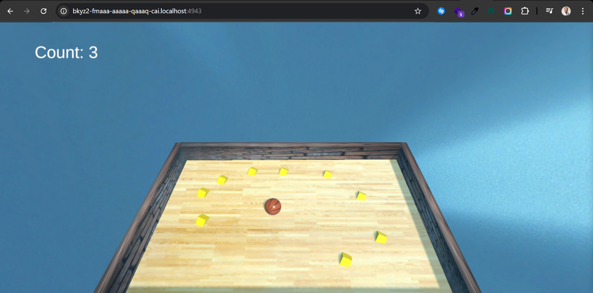

# BallClean Game

**BallClean** is a relaxing and fun game built using **Unity** and the **iCVR framework**. The game is designed to help players unwind and enjoy a unique gameplay experience where they use a basketball to clean a basketball court. It combines the satisfaction of cleaning with the fun of basketball mechanics, creating a calming yet engaging experience.




## Game Overview
- **Objective**: Use a basketball to clean a basketball court by rolling it around to remove dirt.
- **Gameplay Mechanics**:
  - Control the basketball using intuitive Keyboard Arrow(up,down,left and right).
  - Roll the ball across the court to clean dirty spots.
  - Complete levels by cleaning the court within a time limit or achieving a specific cleanliness score.
- **Relaxing Experience**: The game is designed to be calming and stress-relieving, with soothing visuals.


## Features
- **Realistic Physics**: The basketball interacts with the court and dirt using Unity's physics engine.
- **Interactive Environment**: The basketball court reacts to the ball's movement, creating an immersive experience.
- **iCVR Framework Integration**: Leverages the iCVR framework for enhanced interactivity and performance.


## Tools and Technologies
- **Unity**: The game is built using Unity, a powerful game development platform.
- **iCVR Framework**: The iCVR framework is used to enhance interactivity and optimize performance.
- **C#**: All game logic and mechanics are implemented using C#.
- **Unity Physics**: Realistic ball movement and interactions are achieved using Unity's physics system.

## Installation
1. Clone the repository:
   ```
   git clone https://github.com/Rutarenzi/IcpGame.git
   cd IcpGame/icvr-canister
   dfx start --clean --background
    npm run setup
    npm run build
    npm run start
   ```
2. Browse  http://{Frontend canister id}.localhost:4943/
3. Play using arrow key on you keyboard

---

## Contribution
Contributions are welcome! If you'd like to contribute to the project, please follow these steps:
1. Fork the repository.
2. Create a new branch for your feature or bug fix.
3. Submit a pull request with a detailed description of your changes.

---

## License
This project is licensed under the MIT License. See the [LICENSE](LICENSE) file for details.

---

## Credits
- **Special Thanks**: Unity Technologies, iCVR Framework Team

---

Enjoy the game and let the cleaning begin! 🏀✨
